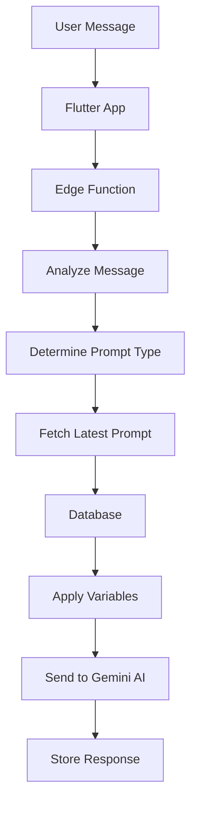

# Dynamic Prompts System Guide

## 🎯 Overview

The Dynamic Prompts System replaces hardcoded prompts in the Learning Conversation function with a flexible, versioned database-driven approach. This allows you to update AI behavior without redeploying functions.

## 🆕 What Changed

### **Before (Hardcoded)**
```dart
// Hardcoded prompt in Flutter service
final prompt = "You are an English teacher...";
```

### **After (Dynamic)**
```sql
-- Prompts stored in database with versioning
SELECT * FROM get_latest_prompt('conversation');
```

## 📊 Architecture



## 🗄️ Database Schema

### **Prompts Table**
```sql
CREATE TABLE prompts (
  id BIGSERIAL PRIMARY KEY,
  prompt_type TEXT NOT NULL,        -- 'educational', 'conversation', 'practice', 'assessment'
  prompt_name TEXT NOT NULL,        -- Descriptive name
  version INTEGER NOT NULL,         -- Version number
  content TEXT NOT NULL,            -- Prompt template with {variables}
  variables JSONB DEFAULT '{}',     -- Available variables metadata
  is_active BOOLEAN DEFAULT TRUE,   -- Enable/disable prompt
  is_latest BOOLEAN DEFAULT FALSE,  -- Only one latest per type
  created_at TIMESTAMPTZ DEFAULT NOW()
);
```

## 🔄 Prompt Types

| Type | Triggered By | Purpose |
|------|--------------|---------|
| **educational** | "explain", "what is", "teach me" | Direct learning requests |
| **conversation** | General chat | Natural dialogue practice |
| **practice** | "practice", "exercise", "quiz" | Structured practice sessions |
| **assessment** | "check", "correct", "feedback" | Performance evaluation |

## 📝 Prompt Template System

### **Variable Substitution**
Prompts use `{variableName}` placeholders:

```sql
-- Template
'Hello {userLevel} student! Let''s focus on {focusAreas}. You said: "{message}"'

-- Processed Result
'Hello intermediate student! Let''s focus on conversation, vocabulary. You said: "Help me practice"'
```

### **Available Variables**
- `{userLevel}` - User's English level (beginner, intermediate, etc.)
- `{focusAreas}` - Learning focus areas as comma-separated string
- `{message}` - User's original message

## 🛠️ Management Functions

### **Get Latest Prompt**
```sql
SELECT * FROM get_latest_prompt('conversation');
```

### **Create New Prompt Version**
```sql
SELECT create_prompt_version(
  'conversation',
  'Friendly Chat Partner v2',
  'You are a friendly English conversation partner for {userLevel} students...',
  '{"userLevel": "string", "focusAreas": "array", "message": "string"}'::jsonb,
  'admin_user'
);
```

### **Activate/Deactivate Prompt**
```sql
-- Set prompt as latest and active
SELECT toggle_prompt_active(1, true, true);

-- Deactivate prompt
SELECT toggle_prompt_active(1, false, false);
```

## 📋 Deployment Guide

### **Step 1: Deploy the System**
```bash
./deploy-dynamic-prompts.sh
```

### **Step 2: Verify Deployment**
```sql
-- Check prompts table
SELECT prompt_type, prompt_name, version, is_latest FROM prompts;

-- Test prompt fetching
SELECT * FROM get_latest_prompt('conversation');
```

### **Step 3: Test with Flutter App**
```dart
final response = await geminiService.sendMessage(
  'Hello, help me practice English',
  userLevel: UserLevel.intermediate,
  focusAreas: ['conversation'],
);
```

## 🔍 Monitoring & Debugging

### **Function Logs**
Look for these log patterns:
```
🎯 [PROMPT] Determined prompt type: conversation for message: "Hello..."
✅ [PROMPT] Using prompt: Friendly Chat Partner v2
💾 [DATABASE] Latest prompt fetched: Friendly Chat Partner v2
```

### **Database Queries**
```sql
-- View all active prompts
SELECT * FROM prompts WHERE is_active = true ORDER BY prompt_type, version DESC;

-- Check prompt usage statistics
SELECT 
  prompt_type,
  COUNT(*) as usage_count,
  AVG(total_tokens_used) as avg_tokens
FROM requests r
JOIN prompts p ON r.metadata->>'promptType' = p.prompt_type
GROUP BY prompt_type;
```

## 🎛️ Creating Custom Prompts

### **Example: Assessment Prompt**
```sql
SELECT create_prompt_version(
  'assessment',
  'Detailed English Assessment',
  'You are an English assessment expert evaluating a {userLevel} level student.

Student Profile:
- Level: {userLevel}
- Focus Areas: {focusAreas}

Assessment Task:
Analyze this student submission: "{message}"

Provide detailed feedback covering:
1. Grammar accuracy
2. Vocabulary usage
3. Sentence structure
4. Areas for improvement
5. Specific recommendations

Make your feedback appropriate for {userLevel} level.',
  '{"userLevel": "string", "focusAreas": "array", "message": "string"}'::jsonb,
  'curriculum_team'
);
```

### **Example: Practice Prompt**
```sql
SELECT create_prompt_version(
  'practice',
  'Interactive Practice Coach',
  'You are an interactive English practice coach for {userLevel} students.

Focus Areas: {focusAreas}

Student Request: "{message}"

Create an engaging practice activity that:
- Matches {userLevel} difficulty
- Focuses on {focusAreas}
- Includes clear instructions
- Provides immediate feedback
- Encourages continued practice

Design the activity now:',
  '{"userLevel": "string", "focusAreas": "array", "message": "string"}'::jsonb,
  'practice_team'
);
```

## 🚨 Troubleshooting

### **No Prompt Found Error**
```
⚠️ [PROMPT] No prompt found for type educational, falling back to conversation
```
**Solution**: Create prompts for all types or check `is_active` status.

### **Template Variable Not Replaced**
**Issue**: `{userLevel}` appears in output instead of actual value
**Solution**: Check variable names match exactly in prompt template.

### **Function Falls Back to Hardcoded Prompt**
```
🔄 [PROMPT] Using emergency fallback prompt
```
**Solution**: Verify database connection and prompt table exists.

## 📈 Best Practices

### **Prompt Development**
1. **Test Incrementally** - Create new versions, test, then activate
2. **Keep Fallbacks** - Always have at least one active prompt per type
3. **Version Control** - Use descriptive prompt names and track changes
4. **A/B Testing** - Compare performance between prompt versions

### **Performance Optimization**
1. **Cache Prompts** - Consider caching frequently used prompts
2. **Monitor Usage** - Track which prompts are most effective
3. **Optimize Length** - Balance detail with token usage

### **Security**
1. **Validate Input** - Ensure variables are properly sanitized
2. **Control Access** - Limit who can create/modify prompts
3. **Audit Changes** - Track prompt modifications

## 🎉 Benefits

### **For Developers**
- ✅ No code changes needed to update AI behavior
- ✅ Easy A/B testing of different prompts
- ✅ Version control for prompt evolution
- ✅ Centralized prompt management

### **For Content Creators**
- ✅ Direct control over AI responses
- ✅ Real-time prompt updates
- ✅ Detailed analytics on prompt performance
- ✅ Collaborative prompt development

### **For Users**
- ✅ More consistent AI responses
- ✅ Better personalization based on level/focus
- ✅ Improved learning outcomes
- ✅ Dynamic content adaptation

## 🔄 Migration From Hardcoded

If you have existing hardcoded prompts:

1. **Extract Current Prompts** - Copy existing prompt text
2. **Create Database Versions** - Use `create_prompt_version()`
3. **Test Equivalence** - Ensure same behavior
4. **Deploy Updated Function** - Remove hardcoded versions
5. **Monitor Performance** - Compare before/after metrics

The dynamic prompts system provides a flexible, scalable foundation for AI conversation management! 🚀